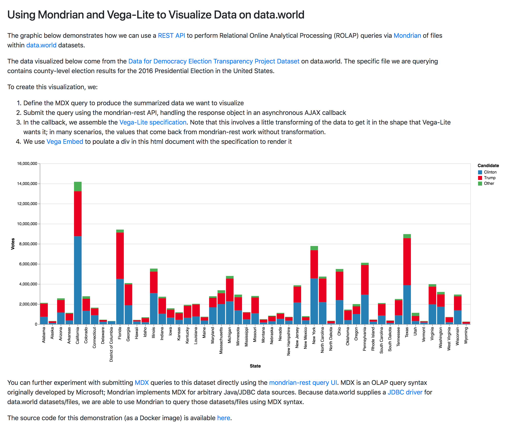

### data.world Mondrian Demonstration

This docker image demonstrates the use of [Mondrian](https://community.hitachivantara.com/docs/DOC-1009853) for performing
online analytical processing (OLAP) queries of files in [data.world](https://data.world/) datasets.  It uses a [REST API wrapper](https://github.com/ojbc/mondrian-rest)
for Mondrian and the data.world [JDBC driver](https://github.com/datadotworld/dw-jdbc) to do the heavy lifting.

One nice benefit of this approach is that the REST API returns results in a format conducive to visualization by
[Vega-Lite](https://vega.github.io/vega-lite/).  The demo includes a static html page that presents data from the 2016 US presidential election,
which resides in a publicly available data.world [dataset](https://data.world/data4democracy/election-transparency):

<kbd></kbd>

The files involved in construction of the image are:

* `Dockerfile`: The dockerfile for the image, derived from the stock [Tomcat 8](http://tomcat.apache.org/tomcat-8.5-doc/) image
* `files/application.properties`: Spring properties file to configure the REST API (the REST API is implemented as a [Spring Boot](http://spring.io/projects/spring-boot) application)
* `files/demo.js`: Javascript file for the static /demo page; mostly handles submission of the MDX query to the API and creation of the Vega-Lite spec for visualization
* `files/index.html`: Simple [Bootstrap 4](https://getbootstrap.com/) html page that provides a visualization demo (available in the container at http://[host]/demo)
* `files/launch-tomcat-with-token.sh`: shell script used as the `CMD` that is run in containers; sets the data.world API token on the REST API's connection configuration to authenticate
data.world JDBC calls
* `files/mondrian-connections.json`: REST API connection configuration
* `files/PresidentialElectionResults2016.xml`: [Mondrian Schema](https://mondrian.pentaho.com/head/documentation/schema.php) that defines the OLAP cubes on top of the sample dataset file

#### Building the image

Build the image from inside the folder containing the Dockerfile and files subdirectory with: `docker build -t data.world-mondrian-demo .`

The image is also publicly available on [DockerHub](https://hub.docker.com/r/scottcame/data.world-mondrian-demo/).

#### Running a container

To run in detatched mode and listen on host port 80 (leave off the `scottcame/` prefix if you've built it locally):

`docker run -d -p 80:80 --name dw-mondrian-demo -e DW_TOKEN=[api token goes here] scottcame/data.world-mondrian-demo`

Note that you need to supply your data.world API token as a container environment variable.  To obtain a token, first sign up for a data.world account (if you don't already have one)
and then visit https://data.world/settings/advanced.

Then (assuming the container is running on localhost), the following are available:

* The demo page:  http://localhost/demo
* The mondrian-rest API:  http://localhost/mondrian-rest (see https://github.com/ojbc/mondrian-rest for API documentation)
* The simple MDX query interface included with the API:  http://localhost/mondrian-rest/query-ui/
